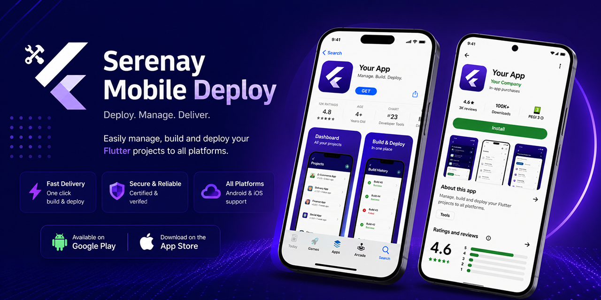

<p align="center">
  
</p>

<p align="center">
  <a href="https://github.com/serenayyazilim/serenay-mobile-deploy/releases/latest"></a>
  <a href="LICENSE"></a>
  
  <a href="https://github.com/serenayyazilim/homebrew-serenay-mobile-deploy"></a>
</p>

# Serenay Mobile Deploy

A desktop app for deploying Flutter-based mobile apps to the App Store, Google Play, and AppGallery.

## Features

- **Multi-platform deploy from a single panel** — manage iOS (App Store Connect), Android (Google Play), and Huawei (AppGallery) build/upload flows from one interface.
- **Fastlane integration** — a Ruby-based deploy script reads and uses the project's `fastlane` metadata (store descriptions, locales).
- **App Store Connect management** — API key authentication, creating/editing/submitting In-App Events, uploading localizations and screenshots, listing territories.
- **Version sync** — aligns the version/build number across `pubspec.yaml` and the iOS and Android project files with a single command.
- **Multi-project / workspace support** — automatically detects and manages either multiple Flutter apps in one workspace (`sermobileboss` mode) or a single project (`generic` mode).
- **Firebase integration** — Firebase account management and project creation.
- **Sentry integration** — release/project creation and auth check (via `~/.sentryclirc` or an environment variable).
- **Slack notifications** — reports deploy success/failure to a Slack channel via webhook.
- **Store localizations** — fetches locale-specific store descriptions from fastlane metadata directories.
- **Multi-language UI** — English and Turkish, switchable in-app.

## Platform support

| Platform | Architecture           | Status                                                                     |
|----------|------------------------|-----------------------------------------------------------------------------|
| macOS    | Apple Silicon (arm64)  | ✅ [Homebrew](https://github.com/serenayyazilim/homebrew-serenay-mobile-deploy) / [direct download](https://github.com/serenayyazilim/serenay-mobile-deploy/releases/latest) |
| macOS    | Intel (x86_64)         | 🚧 Planned                                                                 |
| Windows  | x86_64                 | 🚧 Planned                                                                 |
| Linux    | x86_64                 | 🚧 Planned                                                                 |

## Installation

### Homebrew (macOS, Apple Silicon)

```bash
brew tap serenayyazilim/serenay-mobile-deploy
brew install --cask serenay-mobile-deploy
```

To update to the latest version later:

```bash
brew upgrade --cask serenay-mobile-deploy
```

### First launch

This build isn't signed with a paid Apple Developer ID, so macOS Gatekeeper blocks it as coming from an "unidentified developer" the first time you open it. Either:

- Right-click (or Control-click) the app in Finder/Launchpad and choose **Open**, then confirm in the dialog that appears, **or**
- Remove the quarantine flag from the terminal:

  ```bash
  xattr -dr com.apple.quarantine "/Applications/Serenay Mobile Deploy.app"
  ```

You only need to do this once per install.

## Tech stack

| Layer      | Technology                          |
|------------|---------------------------------------|
| UI         | SvelteKit 5, TypeScript, Tailwind CSS |
| Desktop    | Tauri 2 (Rust)                        |
| Deploy     | Ruby (Fastlane scripts)               |

## Requirements

To build/develop this app:

- [Node.js](https://nodejs.org) 18+
- [Rust](https://www.rust-lang.org/tools/install) (stable) + Tauri system dependencies — see [Tauri Prerequisites](https://tauri.app/start/prerequisites/)
- [Ruby](https://www.ruby-lang.org) (for the deploy scripts)
- [Fastlane](https://fastlane.tools) installed and configured in the project being deployed

To run/build/deploy a Flutter project *through* this app:

- [Flutter SDK](https://flutter.dev/docs/get-started/install), with `flutter`/`dart` available on your `PATH`. The app shells out to these directly — it does not bundle or install the SDK itself.
- Dependencies (`flutter pub get`) and FlutterFire configuration are handled automatically on each run, so a freshly cloned project works without any manual setup step.

## Configuration

App Store Connect credentials (Issuer ID, Key ID, `.p8` private key) and the Slack webhook URL are entered in-app, via **Settings**, per workspace — stored only in that workspace's directory, never sent to the repo or anywhere else. Slack: **Settings > Slack**, paste an [incoming webhook URL](https://api.slack.com/messaging/webhooks), save, and optionally send a test message.

The following integrations are optional and enabled via environment variables instead:

| Variable              | Description                                      |
|------------------------|--------------------------------------------------|
| `SLACK_WEBHOOK_URL`   | Slack webhook URL, used as a fallback when nothing is set in Settings |
| `SENTRY_AUTH_TOKEN`   | Sentry API token (falls back to reading `~/.sentryclirc`) |
| `SENTRY_ORG`          | Sentry organization slug                          |

## Project structure

```
src/                    SvelteKit UI code
├─ lib/components/      UI components
├─ lib/i18n/            EN/TR translations and locale store
├─ lib/stores/          Svelte 5 runes-based state
└─ routes/              Page routes

src-tauri/               Rust (Tauri) backend
├─ src/appstoreconnect/  App Store Connect API client
├─ src/commands/         Tauri commands exposed to the frontend
├─ src/deploy/           Deploy process management
├─ src/firebase/         Firebase CLI integration
├─ src/workspace/        Workspace detection and adapters
└─ scripts/              Fastlane-based Ruby deploy scripts
```

## Contributing

Contributions are welcome. Please open an issue describing what you'd like to change before starting work. Before submitting a pull request:

1. Fork the repo and create a feature branch.
2. Run `npm run check` for type checking.
3. Write a clear PR description explaining your changes.

## License

[MIT](LICENSE)
